# Build Private VPN Service on AWS EC2 Server using Streisand

This tutorial provides a simple and easy way to build VPN service for private usage. There are infinite reasons to build or use VPN service. Though they are out of the scope of this tutorial, they shall not be malicious nor illegal. 

## Prerequisites
### Prerequisite 1: Amazon AWS Access Key
The goal of this step is to get a *disposable* `access key` with fine granded authorities. 
Chrome browser is suggested for the following operations.
If you already have AWS account and familiar with AWS EC2 operations, then you can skip this section.

  1. [Register an AWS account](https://aws.amazon.com).
  
  2. Find and enter into the service `IAM` from the dashboard
  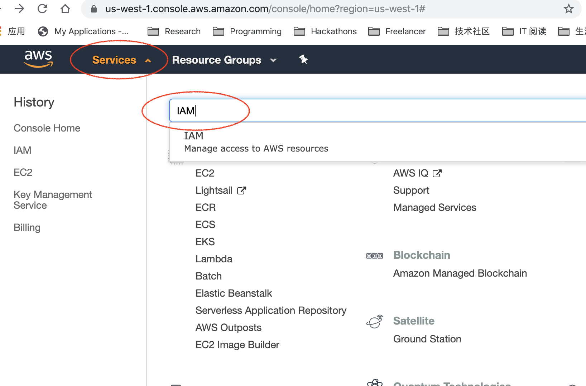

  3. Enter into `Groups` subsection in the section `Access management` of service `IAM`
  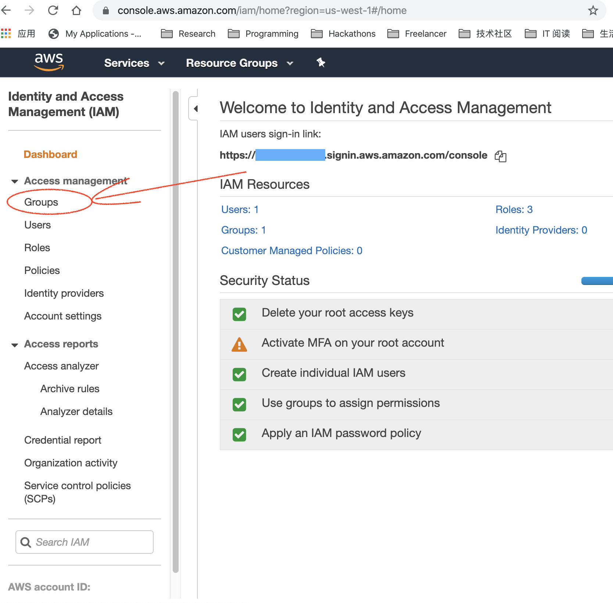

  4. Create new Group
  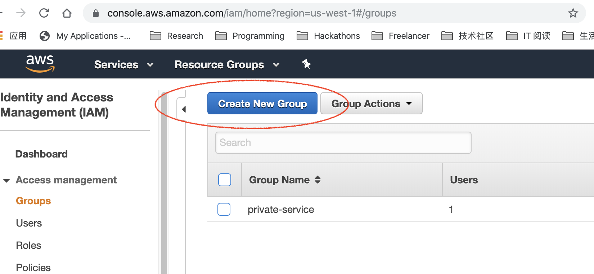

  5. In the step 2 of creating new group, select policy `AmazonEC2FullAccess`
  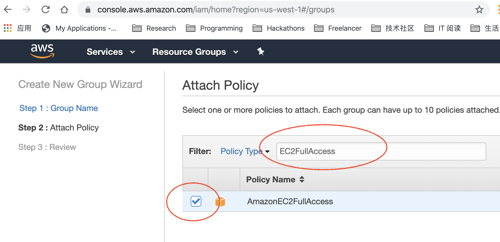

  6. After creating the new group, create a new user
  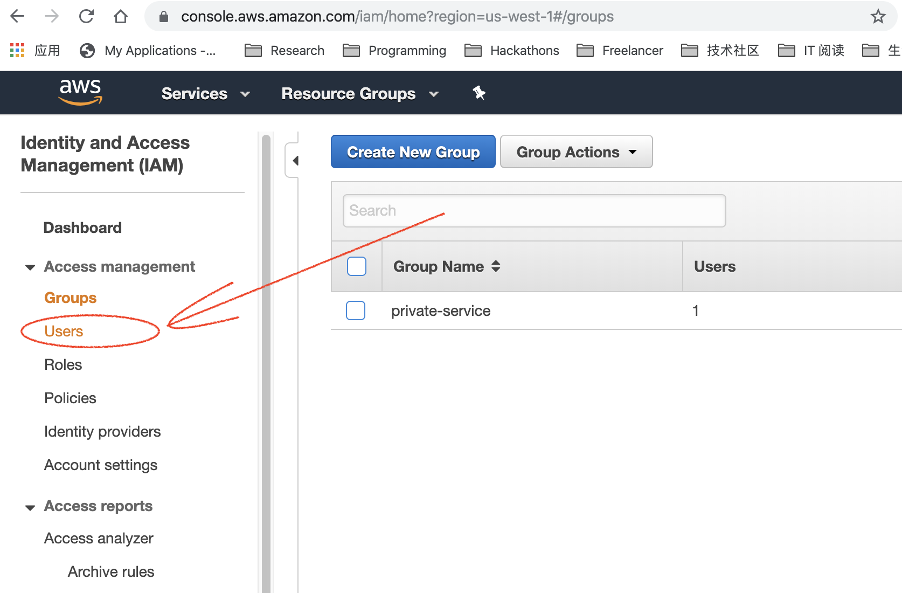
  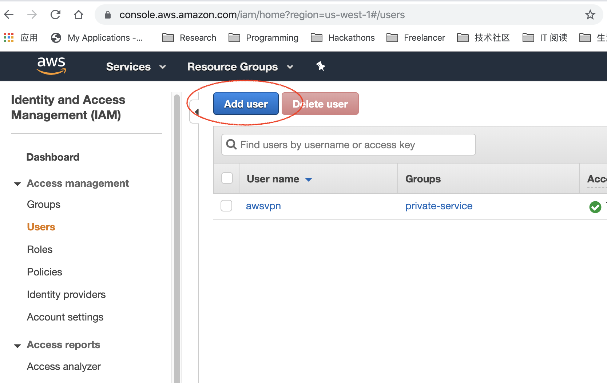

  7. Be aware only select the option `Programmatic access`
  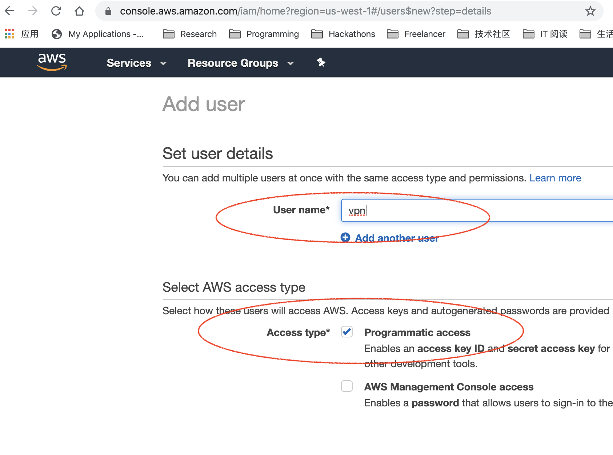

  8. Select the group created in last step
  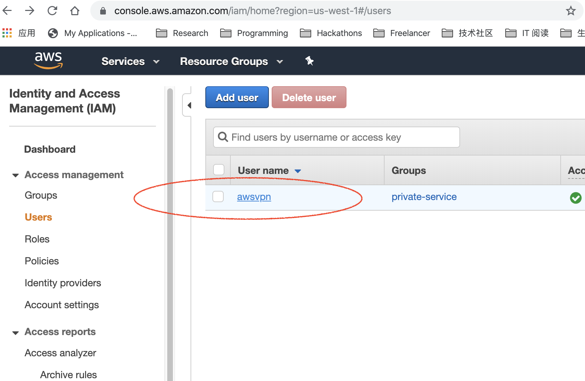

  9. After creating the user, add inline policy
  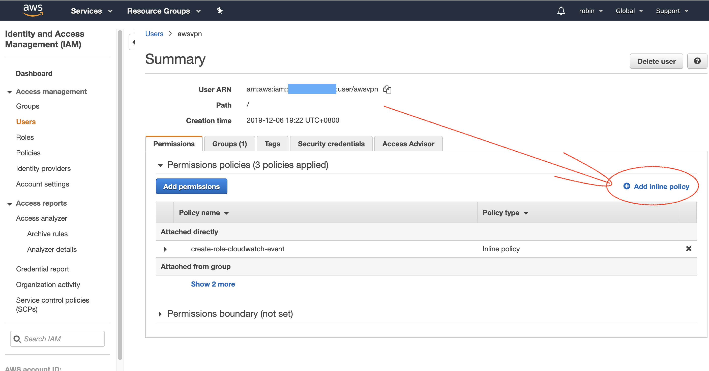

  10. Choose service `IAM` and action `CreateServiceLinkedRole`, then click the link `Add ARN`
  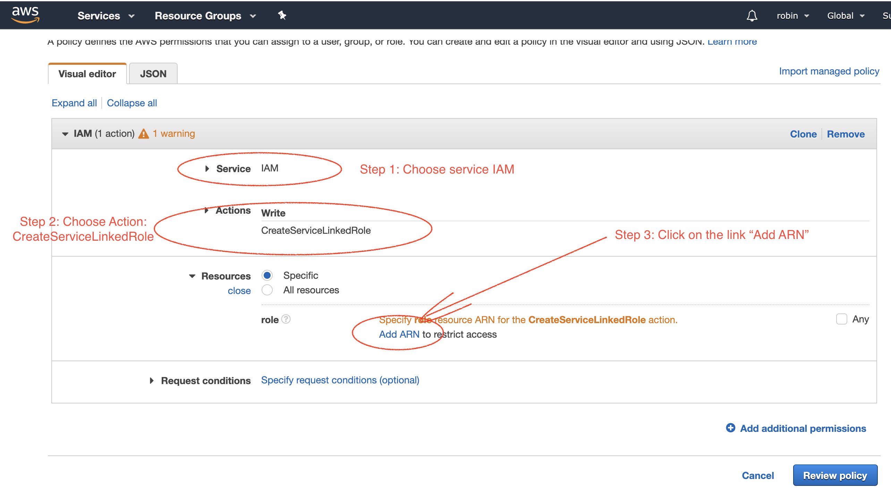

  11. Input the *Role name with path*: `aws-service-role/events.amazonaws.com/AWSServiceRoleForCloudWatchEvents`
  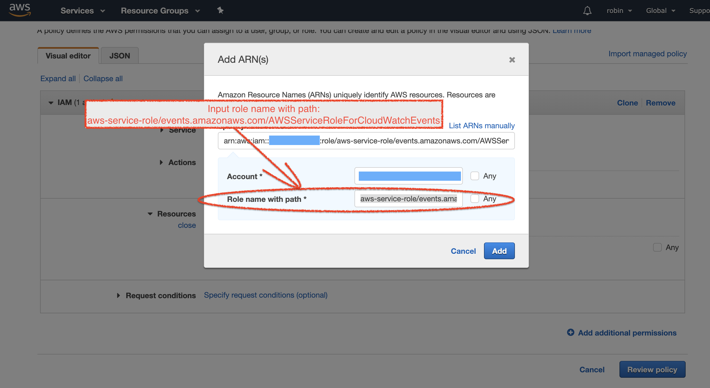

  12. Come back to the user summary page, enter into tab `Security credentials`
  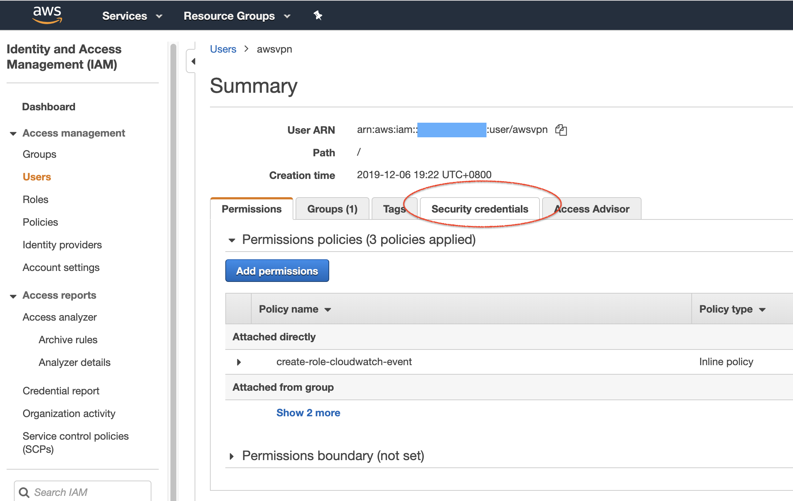

  13. Create access key
  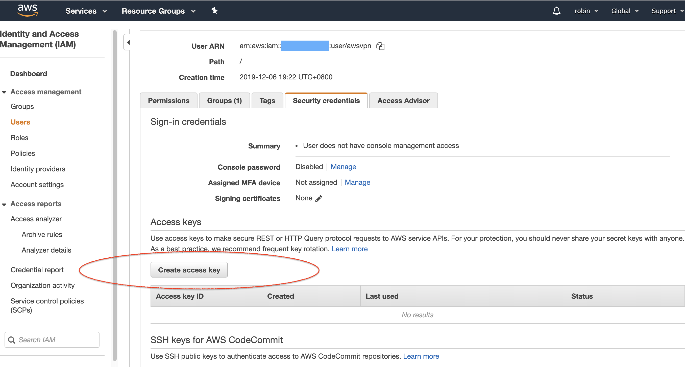

  14. Copy the `Access key ID` and `Secret access key` for future use.
  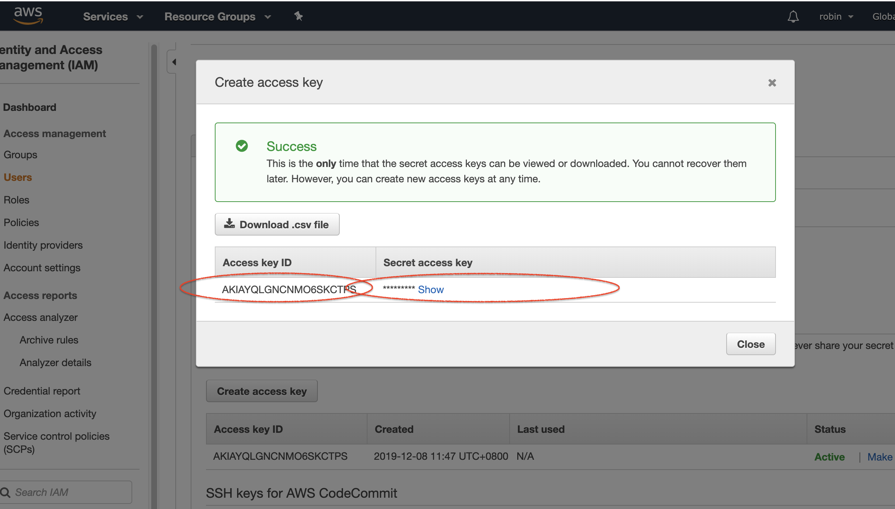
  
  15. When finished the use of the key, don't forget to delete the key right away.
  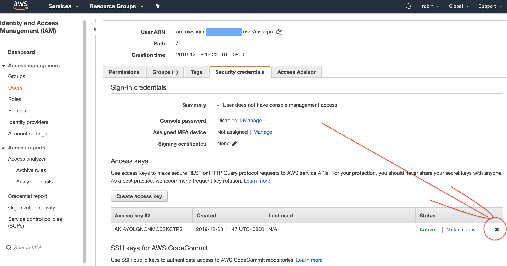

### Prerequisite 2: A machine as `builder`, Virtual Machine with `Ubuntu 18.04 LTS` is suggested

## Streisand
There are two steps: building and connecting.

### Step 1: Building process
Just follow the instruction of its [document](https://github.com/StreisandEffect/streisand), provide everything if needed and press enter key all the way. Only two concerns:

1. The `Access key` will be used during the building process

2. The building process could take twenty minutes or more, sometimes could fail due to bad connection or something else. If the message containing `generated-docs` didn't show at the end of building process, the whole building process shall run once again.

### Step 2: Connecting to your VPN server
1. Open the `generated-docs` in your browser, follow its instructions. 

2. When everything is done in the `generated-docs`, you will be instructed to browse your VPN server in your browser. There you will find everything about using your private VPN service on any kind of client device.

## Good Luck
Of cause you will need luck. But the error messages, if have, shall be paid attention and analyzed carefully. That's where the missing luck always hide in.